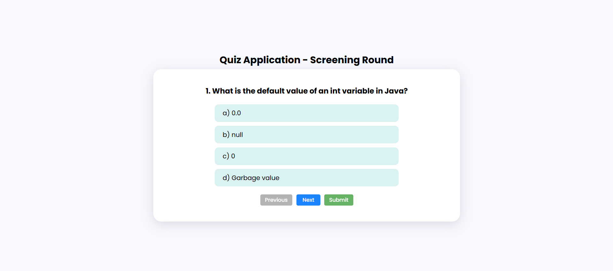
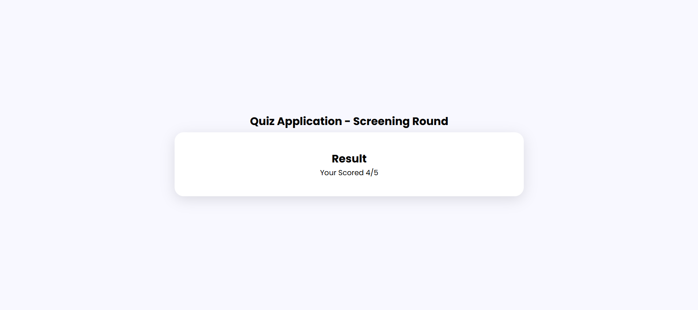

# Quiz App - Screening Round

A simple, responsive, and interactive Quiz Application built using **HTML**, **CSS**, and **JavaScript**. It features multiple-choice questions, navigation buttons, scoring, and a final result screen. Ideal for beginner practice or conducting quick screening rounds.

## 🚀 Features

- Multiple-choice question display
- Next/Previous navigation
- Highlight selected answers
- Auto-score tracking
- Final score display
- Fully responsive design
- Clean UI with modern styling

## 🛠️ Tech Stack

- HTML
- CSS (with Google Fonts)
- JavaScript (DOM manipulation)

## 💻 Live Demo

🔗 [Click here to view the live site](https://your-username.github.io/quiz-app-screening-round)  

## 📸 Screenshots

| Quiz Page | Result Screen |
|-----------|---------------|
|  |  |

